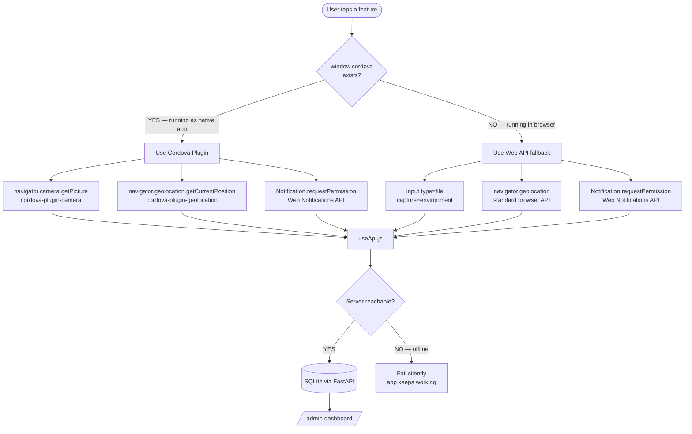
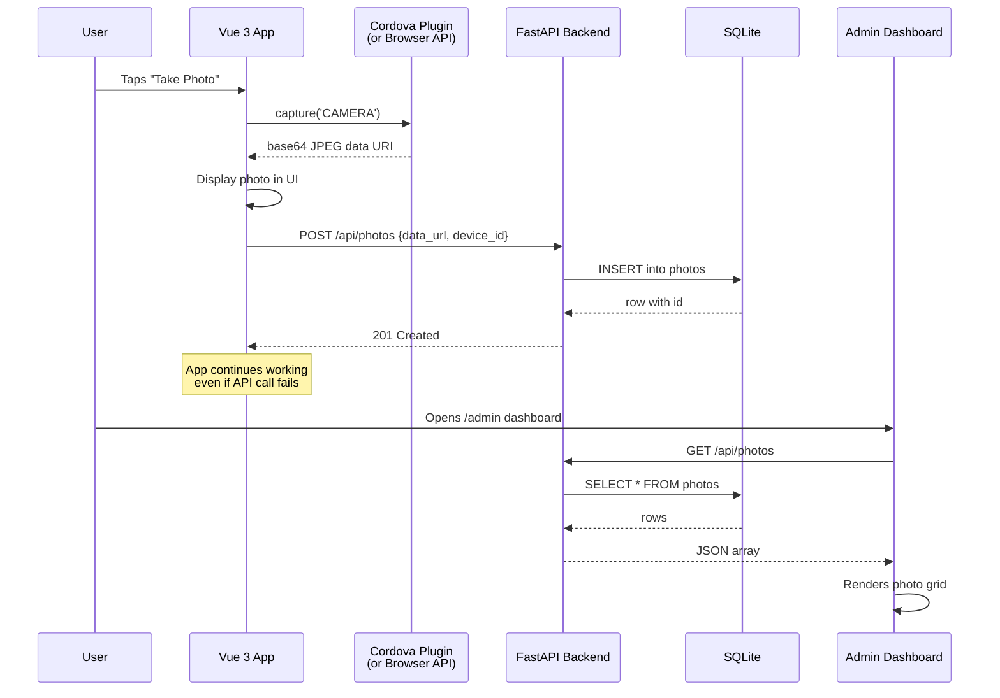
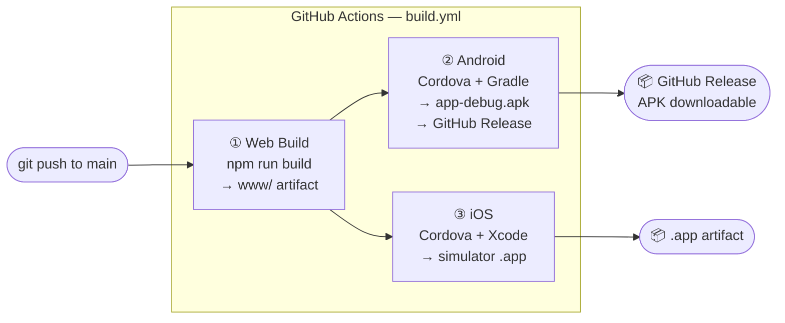

<div align="center">

```
 ██╗  ██╗██╗   ██╗██████╗ ██████╗ ██╗██████╗     ██████╗  ██████╗  ██████╗
 ██║  ██║╚██╗ ██╔╝██╔══██╗██╔══██╗██║██╔══██╗    ██╔══██╗██╔═══██╗██╔════╝
 ███████║ ╚████╔╝ ██████╔╝██████╔╝██║██║  ██║    ██████╔╝██║   ██║██║
 ██╔══██║  ╚██╔╝  ██╔══██╗██╔══██╗██║██║  ██║    ██╔═══╝ ██║   ██║██║
 ██║  ██║   ██║   ██████╔╝██║  ██║██║██████╔╝    ██║     ╚██████╔╝╚██████╗
 ╚═╝  ╚═╝   ╚═╝   ╚═════╝ ╚═╝  ╚═╝╚═╝╚═════╝     ╚═╝      ╚═════╝  ╚═════╝
```

### One codebase. Camera, GPS, notifications. Runs on Android, iOS, and your browser.

<br/>

[](https://codespaces.new/hritishmahajan/hybrid-poc)
&nbsp;
[](https://github.com/hritishmahajan/hybrid-poc/releases/latest/download/app-debug.apk)
&nbsp;


<br/>

</div>

---

## 🧠 How this started

I heard about Vue.js at the office. A colleague mentioned it — quickly, almost in passing — and I was curious. I'd worked with backend code before, but frontend frameworks, mobile builds, hybrid apps — that world felt separate.

So I did what I usually do when something catches my interest: I went down the rabbit hole.

A few searches later I was reading about **Apache Cordova** — a way to take a web app and ship it as a real Android or iOS app, with access to native features like the camera, GPS, and push notifications. Then I found **Quasar** — a Vue component library built specifically for this use case, with a mobile-first design system.

That's when the question formed: *How far can you actually push this? Can a JavaScript app feel like a real native app?*

This project is the answer. It's a **proof-of-concept** I built to understand — hands-on — how Vue 3, Quasar, and Cordova work together, and what the real-world tradeoffs are. Camera, GPS, and notifications all work. On Android, iOS, and in a browser. From the exact same code.

---

## 🌐 Live right now

| | URL |
|---|---|
| **Frontend** | https://app-ten-iota-45.vercel.app |
| **Admin Dashboard** | https://hybrid-poc-server.vercel.app/admin |
| **API Docs** | https://hybrid-poc-server.vercel.app/docs |

> The app defaults to the live backend — open it and start using features. Every capture shows up in the admin instantly.

---

## 🧩 How Vue, Quasar, and Cordova fit together

This is the part I had to figure out from scratch. Here's the mental model that finally made it click:

```
┌─────────────────────────────────────────────────────────────────────┐
│                                                                     │
│   VUE 3 — the brain                                                 │
│   ─────────────────                                                 │
│   Reactive state, components, composables. Doesn't know or         │
│   care whether it's running in a browser or a native app.          │
│   You write logic once. Vue handles the reactivity.                │
│                                                                     │
│   QUASAR — the body                                                 │
│   ─────────────────                                                 │
│   Provides the UI components (buttons, inputs, pages, drawers).    │
│   Designed for mobile. Handles screen sizes, touch events,         │
│   platform-specific styling. Plugs directly into Vue's ecosystem.  │
│                                                                     │
│   CORDOVA — the bridge                                              │
│   ─────────────────────                                             │
│   Wraps the entire Vue + Quasar app in a native WebView.           │
│   Injects a `window.cordova` object and plugin APIs.               │
│   When your JS calls `navigator.camera.getPicture()`,              │
│   Cordova routes that call to the actual native camera API.        │
│   The browser gets a file picker fallback instead.                 │
│                                                                     │
└─────────────────────────────────────────────────────────────────────┘
```

**The key insight:** Vue components never talk to Cordova directly. They call *composables* (`useCamera`, `useGeolocation`, `usePushNotifications`), which handle the Cordova vs. browser decision internally. The UI just works — it doesn't know which path ran.

```
Vue Component
     │
     │  calls
     ▼
Composable (useCamera.js)
     │
     ├─── window.cordova exists? ──YES──► cordova-plugin-camera
     │                                   getPicture() → base64 JPEG
     │
     └─── browser? ────────────NO────► input[type=file capture=environment]
                                        FileReader → base64 JPEG
                                        (same output format either way)
     │
     ▼
useApi.js → POST to FastAPI backend
```

---

## ⚡ Run it — share it — see results live

> One Codespace hosts everything. Share the frontend link, anyone opens it on their phone, and all their captured data appears in your admin in real time.

```
┌─────────────────────────────────────────────────────────────┐
│                   GitHub Codespace                          │
│                                                             │
│   :8000  FastAPI  ──────────────────────────► /admin        │
│      ▲                                    (your dashboard)  │
│      │ data                                                 │
│   :5173  Vite ──► PUBLIC LINK ──► anyone's phone/laptop     │
│                                   camera, GPS, notifications│
└─────────────────────────────────────────────────────────────┘
```

### Step 1 — Launch the Codespace

[](https://codespaces.new/hritishmahajan/hybrid-poc)

Dependencies install automatically. When the terminal is ready, run:

```bash
bash start.sh
```

### Step 2 — Make both ports public

In the **Ports** tab (bottom panel in VS Code), right-click each port → **Port Visibility → Public**:

| Port | What it is |
|------|-----------|
| `5173` | Frontend — share this link with anyone |
| `8000` | Backend — open `/admin` to see captured data |

### Step 3 — Share and watch

Copy the `5173` public URL and send it. Every action from their phone logs to your admin dashboard live.

---

## 🔀 How the native / browser fallback works

Every device feature has two code paths — selected at runtime, invisible to the UI:



---

## 📱 Feature walkthrough

### 01 — Camera

```
┌──────────────────────────────────┐
│  FEATURE — 01                    │
│  CAMERA                          │
│  ─────────────────────────────   │
│                                  │
│  [ TAKE PHOTO ]  [ GALLERY ]     │
│                                  │
│  ┌──────────────────────────┐    │
│  │                          │    │
│  │    captured image here   │    │
│  │                          │    │
│  └──────────────────────────┘    │
│  CAPTURED  14:32:07              │
│                                  │
│  [ ↓ SAVE ]  [ ↗ SHARE ]        │
│                                  │
│  NATIVE  → cordova-plugin-camera │
│  BROWSER → input[type=file]      │
└──────────────────────────────────┘
```

- **TAKE PHOTO** → native camera on a real device, file picker in browser (mobile browsers trigger the camera with `capture="environment"`)
- Output is always a base64 JPEG data URI — same format, same downstream code
- Photo is automatically POSTed to the backend — shows up in `/admin` under Photos

---

### 02 — Geolocation

```
┌──────────────────────────────────┐
│  FEATURE — 02                    │
│  GEOLOCATION                     │
│  ─────────────────────────────   │
│                                  │
│  LAT   37.774929°                │
│  LON  -122.419416°               │
│  ACC   ±12m                      │
│  ALT   52m                       │
│                                  │
│  ADDR                            │
│  Market St, San Francisco, CA    │
│                                  │
│  ┌──────────────────────────┐    │
│  │   🗺  live Leaflet map   │    │
│  └──────────────────────────┘    │
│                                  │
│  [ GET POSITION ]  [ WATCH ]     │
└──────────────────────────────────┘
```

- **GET POSITION** → one-shot GPS fix
- **WATCH** → continuous live tracking (blinking dot indicator)
- Coordinates are reverse-geocoded to a human address via OpenStreetMap Nominatim (free, no API key)
- Leaflet map renders inline with a custom dot pin
- Every fix is POSTed to `/api/locations` — shows up in `/admin` with timestamp

---

### 03 — Notifications

```
┌──────────────────────────────────┐
│  FEATURE — 03                    │
│  NOTIFICATIONS                   │
│  ─────────────────────────────   │
│                                  │
│  DEFAULT  Permission not asked   │
│                              [ENABLE] ◄── tap this first
│                                  │
│  01 COMPOSE                      │
│  TITLE  _____________________    │
│  BODY   _____________________    │
│  DELAY  [3S]  [5S]  [10S]       │
│                                  │
│  [ SCHEDULE · FIRES IN 3S → ]   │
│                                  │
│  02 FEED                         │
│  01 │ HELLO FROM HYBRIDPOC │ ... │
└──────────────────────────────────┘
```

**What is the ENABLE button?**

The first time you open the Notifications page, the browser hasn't been given permission to show notifications yet. The permission status shows as `DEFAULT` (not yet asked).

Tapping **ENABLE** calls `Notification.requestPermission()` — the browser shows its native "Allow notifications?" dialog. Once you allow:
- The `ENABLE` button disappears (you won't see it again)
- The status tag switches to `GRANTED`
- You can now schedule notifications and actually see them pop up as OS-level alerts

If you deny, the status shows `DENIED` and you'd need to go into browser/device Settings to re-enable. That's a browser security rule — the app can't ask again on its own.

**Scheduling a notification:**
1. Type a title and body
2. Pick a delay (3s, 5s, 10s)
3. Tap **SCHEDULE** — the notification fires after the delay as a real OS-level pop-up
4. The event is logged to the backend — shows in `/admin` under Notifications

---

## 🏗️ Full architecture

```
┌─────────────────────────────────────────────────────────────────────┐
│                        YOUR DEVICE / BROWSER                        │
│                                                                     │
│   ┌─────────────────────────────────────────────────────────────┐   │
│   │              Vue 3 + Quasar UI  (src/pages/)                │   │
│   │                                                             │   │
│   │   ┌──────────────┐  ┌──────────────┐  ┌────────────────┐   │   │
│   │   │  CameraPage  │  │ LocationPage │  │  NotifyPage    │   │   │
│   │   └──────┬───────┘  └──────┬───────┘  └───────┬────────┘   │   │
│   │          │                 │                   │            │   │
│   │   ┌──────▼───────┐  ┌──────▼───────┐  ┌───────▼────────┐   │   │
│   │   │  useCamera   │  │useGeolocation│  │usePushNotifs   │   │   │
│   │   │  composable  │  │  composable  │  │  composable    │   │   │
│   │   └──────┬───────┘  └──────┬───────┘  └───────┬────────┘   │   │
│   └──────────┼─────────────────┼───────────────────┼────────────┘   │
│              │                 │                   │                 │
│   ┌──────────▼─────────────────▼───────────────────▼────────────┐   │
│   │                   Apache Cordova Shell                       │   │
│   │         (bridges JS calls → native device APIs)              │   │
│   │                                                             │   │
│   │    cordova-plugin-camera    cordova-plugin-geolocation       │   │
│   │         (native)                  (native)                  │   │
│   │    Web Notifications API    (browser fallback for all)       │   │
│   └─────────────────────────────────────────────────────────────┘   │
│                                                                     │
└─────────────────────────────────────────────────────────────────────┘
                              │  useApi.js (silent POST)
                              ▼
┌─────────────────────────────────────────────────────────────────────┐
│                        FastAPI Backend                              │
│                                                                     │
│   POST /api/locations     POST /api/photos     POST /api/notifications│
│                                                                     │
│   ┌──────────────────────────────────────────────────────────┐      │
│   │              SQLAlchemy  ──►  SQLite (hybridpoc.db)      │      │
│   └──────────────────────────────────────────────────────────┘      │
│                                                                     │
│   GET /admin  ──►  Admin Dashboard (admin.html)                     │
└─────────────────────────────────────────────────────────────────────┘
```

---

## 🔄 Data flow — end to end



---

## 🚀 CI/CD pipeline

Every push to `main` triggers three jobs:



The Android job publishes a real **GitHub Release** tagged `latest` — this is what the Download APK badge points to.

---

## 🖥️ Admin dashboard

A single-file HTML dashboard served directly by FastAPI — no build step, no framework.

```
┌──────────────────────────────────────────────────────────┐
│  HYBRIDPOC / ADMIN                              v1.0  ●  │
├────────────┬─────────────────────────────────────────────┤
│            │  LOCATIONS      PHOTOS      NOTIFICATIONS   │
│  VIEWS     │     14            7               3         │
│            ├─────────────────────────────────────────────┤
│  00 OVERVIEW│                                            │
│  01 LOCATIONS│  LATEST LOCATION                          │
│  02 PHOTOS  │  37.774929°, -122.419416°                  │
│  03 NOTIFS  │  Market St, SF · 2 min ago                 │
│             │                                            │
│  → SWAGGER  │  LATEST NOTIFICATION                       │
│             │  Hello from the app!  · just now           │
└────────────┴────────────────────────────────────────────┘
```

Features: live stats, paginated tables, photo grid with full-size modal, one-click delete, auto-refresh.

Live: https://hybrid-poc-server.vercel.app/admin

---

## 🗂️ Project structure

```
hybrid-poc/
│
├── .devcontainer/
│   └── devcontainer.json        ← Codespaces: installs deps, forwards ports
│
├── app/                         ← THE MOBILE APP
│   ├── src/
│   │   ├── main.js              ← waits for Cordova "deviceready" before mounting Vue
│   │   ├── App.vue              ← drawer + bottom tab navigation shell
│   │   ├── router/
│   │   │   └── index.js         ← hash-mode routing (mandatory for Cordova file:// URLs)
│   │   │
│   │   ├── pages/
│   │   │   ├── HomePage.vue     ← live device info, server config
│   │   │   ├── CameraPage.vue   ← photo capture, download, share
│   │   │   ├── LocationPage.vue ← GPS, live watch, reverse geocode, Leaflet map
│   │   │   └── NotifyPage.vue   ← permission request, scheduled notifications
│   │   │
│   │   └── composables/
│   │       ├── useCamera.js           ← Cordova cam OR browser file input
│   │       ├── useGeolocation.js      ← Cordova GPS OR navigator.geolocation
│   │       ├── usePushNotifications.js← Web Notifications API (Cordova-ready)
│   │       └── useApi.js              ← silent POST to backend (offline-safe)
│   │
│   ├── cordova/
│   │   └── config.xml           ← app identity, permissions, plugin declarations
│   │
│   ├── .github/workflows/
│   │   └── build.yml            ← CI: web → Android APK (+ GitHub Release) → iOS
│   │
│   └── package.json
│
└── server/                      ← THE BACKEND
    ├── main.py                  ← FastAPI app, all routes, serves /admin
    ├── database.py              ← SQLAlchemy models (Location, Photo, Notification)
    ├── schemas.py               ← Pydantic request/response validation
    ├── admin.html               ← full admin dashboard, zero build step
    └── requirements.txt
```

---

## 🛠️ Tech stack

| Layer | Technology | Why |
|-------|-----------|-----|
| UI framework | **Vue 3** — Composition API | Reactive, lightweight, composables map cleanly to device features |
| Components | **Quasar 2** | Material Design + mobile-first utilities out of the box |
| Bundler | **Vite 5** | Sub-second HMR, fast cold starts, outputs to Cordova `www/` |
| Native shell | **Apache Cordova** | Plugin ecosystem, targets Android + iOS from one JS build |
| Routing | **Vue Router 4** (hash mode) | Hash history works on Cordova `file://` URLs without a server |
| Backend | **FastAPI** | Auto-generates Swagger docs, async, minimal boilerplate |
| ORM | **SQLAlchemy 2** | Typed models, clean query interface |
| Database | **SQLite** | Zero config, single file, perfect for a POC |
| CI/CD | **GitHub Actions** | Free for public repos, publishes APK to GitHub Releases |
| Hosting | **Vercel** | Frontend + backend deployed from CLI in minutes |

---

## 📡 Backend API reference

Base URL: `https://hybrid-poc-server.vercel.app` · Swagger UI at `/docs`

| Method | Endpoint | What it does |
|--------|----------|-------------|
| `GET` | `/health` | Server liveness check |
| `GET` | `/admin` | Admin dashboard UI |
| `GET` | `/api/stats` | Record counts + latest entry per type |
| `POST` | `/api/locations` | Log a GPS coordinate |
| `GET` | `/api/locations` | List all locations (paginated) |
| `DELETE` | `/api/locations/{id}` | Delete a location record |
| `POST` | `/api/photos` | Store a base64 photo |
| `GET` | `/api/photos` | List photo metadata (no data_url) |
| `GET` | `/api/photos/{id}` | Fetch a single photo with full data_url |
| `DELETE` | `/api/photos/{id}` | Delete a photo |
| `POST` | `/api/notifications` | Log a notification event |
| `GET` | `/api/notifications` | List all notifications |
| `DELETE` | `/api/notifications/{id}` | Delete a notification record |

---

## 📲 Download and install on Android

The CI pipeline builds a debug APK on every push to `main` and publishes it as a GitHub Release.

<div align="center">

[](https://github.com/hritishmahajan/hybrid-poc/releases/latest/download/app-debug.apk)

</div>

**Direct link:**
```
https://github.com/hritishmahajan/hybrid-poc/releases/latest/download/app-debug.apk
```

**To install:**
1. Open the link above on your Android device
2. Go to **Settings → Install unknown apps** and allow your browser
3. Open the downloaded `.apk` and tap Install

**The APK is already wired to the live backend.** Camera shots, GPS pings, and notifications all POST to `https://hybrid-poc-server.vercel.app` automatically. Open the [admin dashboard](https://hybrid-poc-server.vercel.app/admin) in another tab and watch data arrive from your phone in real time.

> This is a debug build — unsigned, not Play Store–ready. Suitable for testing and demos.

---

### iOS

iOS requires a paid Apple Developer account ($99/year) to install on a real device. The CI builds a simulator `.app` for local Xcode testing:

```bash
cd app && npm run build:ios
# open cordova/platforms/ios/ in Xcode → run on simulator
```

<details>
<summary><b>Build Android locally</b></summary>

**Prerequisites:** Android Studio · Android SDK · Java 17 · `npm install -g cordova`

```bash
cd app
npm run build:android
# APK → cordova/platforms/android/app/build/outputs/apk/debug/app-debug.apk
```
</details>

<details>
<summary><b>Firebase Push Notifications (production)</b></summary>

The app uses the Web Notifications API by default (works in browser and Cordova WebView without a backend). For full server-sent push notifications to locked devices:

1. Create a Firebase project
2. Download `google-services.json` (Android) / `GoogleService-Info.plist` (iOS)
3. Replace `YOUR_FIREBASE_SENDER_ID` in `app/cordova/config.xml`
4. Place the files in `app/cordova/platforms/android/app/`
5. Install `phonegap-plugin-push` and update `usePushNotifications.js`

</details>

---

<div align="center">

Built by **Hritish Mahajan** — started from curiosity, ended with a working hybrid app.

*Vue 3 · Quasar · Cordova · FastAPI · SQLite · GitHub Actions · Vercel*

</div>
