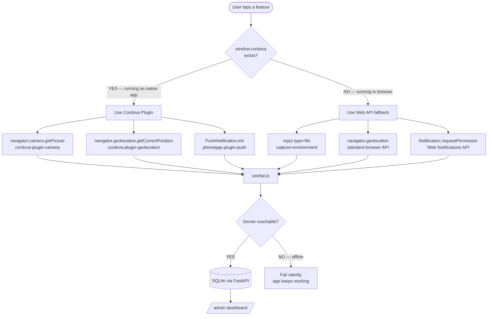
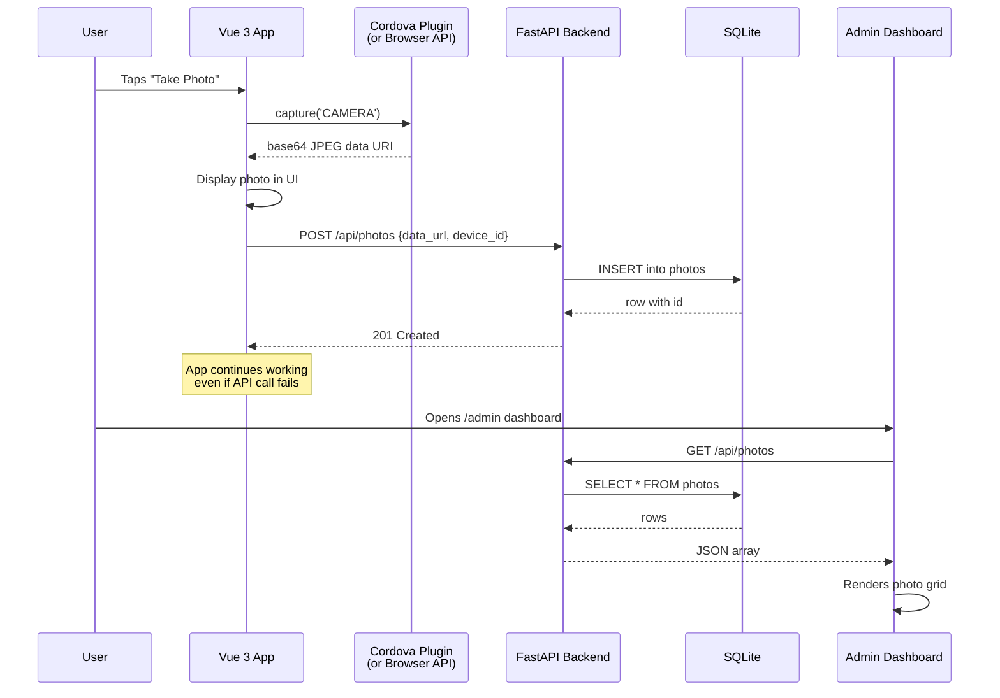
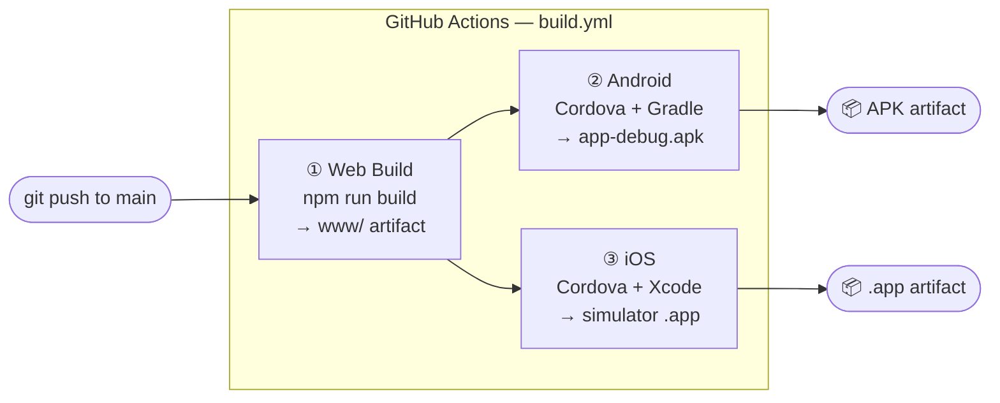

<div align="center">

```
 ██╗  ██╗██╗   ██╗██████╗ ██████╗ ██╗██████╗     ██████╗  ██████╗  ██████╗
 ██║  ██║╚██╗ ██╔╝██╔══██╗██╔══██╗██║██╔══██╗    ██╔══██╗██╔═══██╗██╔════╝
 ███████║ ╚████╔╝ ██████╔╝██████╔╝██║██║  ██║    ██████╔╝██║   ██║██║
 ██╔══██║  ╚██╔╝  ██╔══██╗██╔══██╗██║██║  ██║    ██╔═══╝ ██║   ██║██║
 ██║  ██║   ██║   ██████╔╝██║  ██║██║██████╔╝    ██║     ╚██████╔╝╚██████╗
 ╚═╝  ╚═╝   ╚═╝   ╚═════╝ ╚═╝  ╚═╝╚═╝╚═════╝     ╚═╝      ╚═════╝  ╚═════╝
```

### One codebase. Three native features. Runs on Android, iOS, and your browser.

<br/>

[](https://codespaces.new/hritishmahajan/hybrid-poc)
&nbsp;
[](https://github.com/hritishmahajan/hybrid-poc/releases/latest/download/app-debug.apk)
&nbsp;


<br/>

</div>

---

## ⚡ Run it — share it — see results live

> One Codespace hosts everything. You share the frontend link, anyone on any device opens it, and all their captured data appears in your admin dashboard in real time.

```
┌─────────────────────────────────────────────────────────────┐
│                   GitHub Codespace                          │
│                                                             │
│   :8000  FastAPI  ──────────────────────────► /admin        │
│      ▲                                    (your dashboard)  │
│      │ data                                                 │
│   :5173  Vite ──► PUBLIC LINK ──► anyone's phone/laptop     │
│                                   camera, GPS, notifications│
└─────────────────────────────────────────────────────────────┘
```

### Step 1 — Launch the Codespace

[](https://codespaces.new/hritishmahajan/hybrid-poc)

Dependencies install automatically. When the terminal is ready, run:

```bash
bash start.sh
```

That's it. Both servers start, and the frontend is already configured to talk to the backend using the correct public Codespaces URL.

### Step 2 — Make both ports public

In the **Ports** tab (bottom panel in VS Code), right-click each port and set **Port Visibility → Public**:

| Port | What it is |
|------|-----------|
| `5173` | Frontend — **share this link with anyone** |
| `8000` | Backend — open `/admin` to see captured data |

> Ports are set to public automatically via `.devcontainer/devcontainer.json`, but if it doesn't take effect, set them manually here.

### Step 3 — Share the link

Copy the public URL for port `5173` from the Ports tab and send it to anyone. They open it on their phone or laptop — camera, GPS, and notifications all work. Every action logs to your SQLite database via the backend.

### Step 4 — Watch results in the admin

Open the port `8000` public URL in your browser and add `/admin`. You'll see every location ping, photo captured, and notification sent — updating as people use the app.

---

## 🤔 What is this, exactly?

Most mobile teams face a choice: go **fully native** (fast, expensive, two codebases) or **fully web** (cheap, limited hardware access). Hybrid apps are the middle path — one JavaScript codebase that compiles into a real `.apk` / `.ipa`, with plugins that bridge into native device APIs.

This project is a working proof-of-concept that answers: *"How far can you push a hybrid app before you need to go native?"*

The answer: pretty far. Camera, GPS, and push notifications all work — on Android, iOS, and in a browser — from the exact same Vue 3 component code.

---

## 🏗️ How it's built — the big picture

```
┌─────────────────────────────────────────────────────────────────────┐
│                        YOUR DEVICE / BROWSER                        │
│                                                                     │
│   ┌─────────────────────────────────────────────────────────────┐   │
│   │              Vue 3 + Quasar UI  (src/pages/)                │   │
│   │                                                             │   │
│   │   ┌──────────────┐  ┌──────────────┐  ┌────────────────┐   │   │
│   │   │  CameraPage  │  │ LocationPage │  │  NotifyPage    │   │   │
│   │   └──────┬───────┘  └──────┬───────┘  └───────┬────────┘   │   │
│   │          │                 │                   │            │   │
│   │   ┌──────▼───────┐  ┌──────▼───────┐  ┌───────▼────────┐   │   │
│   │   │  useCamera   │  │useGeolocation│  │usePushNotifs   │   │   │
│   │   │  composable  │  │  composable  │  │  composable    │   │   │
│   │   └──────┬───────┘  └──────┬───────┘  └───────┬────────┘   │   │
│   └──────────┼─────────────────┼───────────────────┼────────────┘   │
│              │                 │                   │                 │
│   ┌──────────▼─────────────────▼───────────────────▼────────────┐   │
│   │                   Apache Cordova Shell                       │   │
│   │         (bridges JS calls → native device APIs)              │   │
│   │                                                             │   │
│   │    cordova-plugin-camera    cordova-plugin-geolocation       │   │
│   │    phonegap-plugin-push     cordova-plugin-local-notification│   │
│   └─────────────────────────────────────────────────────────────┘   │
│                                                                     │
└─────────────────────────────────────────────────────────────────────┘
                              │  useApi.js (silent POST)
                              ▼
┌─────────────────────────────────────────────────────────────────────┐
│                        FastAPI Backend                              │
│                                                                     │
│   POST /api/locations     POST /api/photos     POST /api/notifications│
│                                                                     │
│   ┌──────────────────────────────────────────────────────────┐      │
│   │              SQLAlchemy  ──►  SQLite (hybridpoc.db)      │      │
│   └──────────────────────────────────────────────────────────┘      │
│                                                                     │
│   GET /admin  ──►  Admin Dashboard (admin.html)                     │
└─────────────────────────────────────────────────────────────────────┘
```

---

## 🔀 The native/browser fallback strategy

This is the core engineering decision in the project. Every device feature has two code paths, selected at runtime:



The key insight: **the Vue components never know which path ran.** The composables (`useCamera`, `useGeolocation`, `usePushNotifications`) return identical reactive refs regardless of whether they used a Cordova plugin or a browser API. The UI just works.

---

## 📱 Feature walkthrough

### 01 — Camera

```
┌──────────────────────────────────┐
│  CAMERA                          │
│  ─────────────────────────────   │
│                                  │
│  [ TAKE PHOTO ]  [ GALLERY ]     │
│                                  │
│  ┌──────────────────────────┐    │
│  │                          │    │
│  │    captured image here   │    │
│  │                          │    │
│  └──────────────────────────┘    │
│  CAPTURED  14:32:07              │
│                                  │
│  [ ↓ SAVE ]  [ ↗ SHARE ]        │
│                                  │
│  NATIVE  cordova-plugin-camera   │
│  BROWSER input[type=file]        │
└──────────────────────────────────┘
```

Tap **TAKE PHOTO** → Cordova opens the native camera on a real device. In the browser it opens a file picker (with `capture="environment"` on mobile, which also triggers the camera). The result is always a base64 JPEG data URI — same format, same downstream code.

---

### 02 — Geolocation

```
┌──────────────────────────────────┐
│  GEOLOCATION                     │
│  ─────────────────────────────   │
│                                  │
│  LAT   37.774929°                │
│  LON  -122.419416°               │
│  ACC   ±12m                      │
│  ALT   52m                       │
│                                  │
│  ADDRESS                         │
│  Market St, San Francisco, CA    │
│                                  │
│  ┌──────────────────────────┐    │
│  │   🗺  OpenStreetMap      │    │
│  │     (live pin)           │    │
│  └──────────────────────────┘    │
│                                  │
│  [ GET LOCATION ]  [ WATCH ]     │
└──────────────────────────────────┘
```

Single fetch or continuous live watch — your choice. Coordinates are reverse-geocoded to a human address via OpenStreetMap Nominatim (free, no API key). The live map renders using Leaflet embedded directly in the Vue component.

---

### 03 — Push Notifications

```
┌──────────────────────────────────┐
│  NOTIFICATIONS                   │
│  ─────────────────────────────   │
│                                  │
│  ┌────────────────────────────┐  │
│  │ 🔔 HybridPOC               │  │
│  │    Hello from the app!     │  │
│  └────────────────────────────┘  │
│                                  │
│  TITLE  _____________________    │
│  BODY   _____________________    │
│                                  │
│  [ REQUEST PERMISSION ]          │
│  [ SEND NOTIFICATION  ]          │
│                                  │
│  NATIVE  phonegap-plugin-push    │
│  BROWSER Web Notifications API   │
└──────────────────────────────────┘
```

On native: registers with FCM (Android) or APNs (iOS) and receives real push tokens. In the browser: uses the Web Notifications API — you'll see an actual OS notification pop up. Both paths log to the backend.

---

## 🗂️ Project structure

```
hybrid-poc/
│
├── .devcontainer/
│   └── devcontainer.json        ← Codespaces: installs deps, forwards ports
│
├── app/                         ← THE MOBILE APP
│   ├── src/
│   │   ├── main.js              ← waits for Cordova "deviceready" before mounting Vue
│   │   ├── App.vue              ← drawer + bottom tab navigation shell
│   │   ├── router/
│   │   │   └── index.js         ← hash-mode routing (mandatory for Cordova file:// URLs)
│   │   │
│   │   ├── pages/
│   │   │   ├── HomePage.vue     ← live device info (platform, model, UUID)
│   │   │   ├── CameraPage.vue   ← photo capture, download, share
│   │   │   ├── LocationPage.vue ← GPS, live watch, reverse geocode, Leaflet map
│   │   │   └── NotifyPage.vue   ← permission request, local + push alerts
│   │   │
│   │   └── composables/
│   │       ├── useCamera.js           ← Cordova cam OR browser file input
│   │       ├── useGeolocation.js      ← Cordova GPS OR navigator.geolocation
│   │       ├── usePushNotifications.js← PhoneGap Push OR Web Notifications
│   │       └── useApi.js              ← silent POST to backend (offline-safe)
│   │
│   ├── cordova/
│   │   └── config.xml           ← app identity, permissions, plugin declarations
│   │
│   ├── .github/workflows/
│   │   └── build.yml            ← CI: web → Android APK → iOS .app
│   │
│   └── package.json
│
└── server/                      ← THE BACKEND
    ├── main.py                  ← FastAPI app, all routes, serves /admin
    ├── database.py              ← SQLAlchemy models (Location, Photo, Notification)
    ├── schemas.py               ← Pydantic request/response validation
    ├── admin.html               ← full admin dashboard, zero build step
    └── requirements.txt
```

---

## 🔄 Data flow — end to end



---

## 🚀 CI/CD pipeline

Every push to `main` triggers three parallel jobs:



Artifacts are uploaded and downloadable from the GitHub Actions run — no signing required for the debug builds.

---

## 🛠️ Tech stack

| Layer | Technology | Why |
|-------|-----------|-----|
| UI framework | **Vue 3** — Composition API | Reactive, lightweight, composables map cleanly to device features |
| Components | **Quasar 2** | Material Design + mobile-first utilities out of the box |
| Bundler | **Vite 5** | Sub-second HMR, fast cold starts, Cordova `www/` output |
| Native shell | **Apache Cordova** | Mature plugin ecosystem, targets Android + iOS from one build |
| Routing | **Vue Router 4** (hash mode) | Hash history works on Cordova `file://` URLs without a server |
| Backend | **FastAPI** | Auto-generates Swagger docs, async, minimal boilerplate |
| ORM | **SQLAlchemy 2** | Typed models, migrations path if needed later |
| Database | **SQLite** | Zero config, single file, perfect for a POC |
| CI/CD | **GitHub Actions** | Free for public repos, matrix builds for web/Android/iOS |

---

## 📡 Backend API reference

Base URL: `http://localhost:8000` · No auth on localhost · Swagger UI at `/docs`

| Method | Endpoint | What it does |
|--------|----------|-------------|
| `GET` | `/health` | Server liveness check |
| `GET` | `/admin` | Admin dashboard UI |
| `GET` | `/api/stats` | Record counts + latest entry per type |
| `POST` | `/api/locations` | Log a GPS coordinate |
| `GET` | `/api/locations` | List all locations (paginated) |
| `DELETE` | `/api/locations/{id}` | Delete a location record |
| `POST` | `/api/photos` | Store a base64 photo |
| `GET` | `/api/photos` | List photo metadata (no data_url) |
| `GET` | `/api/photos/{id}` | Fetch a single photo with full data_url |
| `DELETE` | `/api/photos/{id}` | Delete a photo |
| `POST` | `/api/notifications` | Log a notification event |
| `GET` | `/api/notifications` | List all notifications |
| `DELETE` | `/api/notifications/{id}` | Delete a notification record |

---

## 🖥️ Admin dashboard

A single-file HTML dashboard served directly by FastAPI — no build step, no framework.

```
┌──────────────────────────────────────────────────────────┐
│  HYBRIDPOC / ADMIN                              v1.0  ●  │
├────────────┬─────────────────────────────────────────────┤
│            │  LOCATIONS      PHOTOS      NOTIFICATIONS   │
│  VIEWS     │     14            7               3         │
│            ├─────────────────────────────────────────────┤
│  00 OVERVIEW│                                            │
│  01 LOCATIONS│  LATEST LOCATION                          │
│  02 PHOTOS  │  37.774929°, -122.419416°                  │
│  03 NOTIFS  │  Market St, SF · 2 min ago                 │
│             │                                            │
│  → SWAGGER  │  LATEST NOTIFICATION                       │
│             │  Hello from the app!  · just now           │
└────────────┴────────────────────────────────────────────┘
```

Features: live stats, paginated tables, photo grid with full-size modal, one-click delete, auto-refresh.

---

## 📲 Install on a real device

### Android — download the APK

Every push to `main` automatically builds a debug APK and attaches it to the GitHub Release.

[](https://github.com/hritishmahajan/hybrid-poc/releases/latest/download/app-debug.apk)

**Direct link:**
```
https://github.com/hritishmahajan/hybrid-poc/releases/latest/download/app-debug.apk
```

To install:
1. Download the APK on your Android device (tap the link above from your phone)
2. Go to **Settings → Install unknown apps** and allow your browser
3. Open the downloaded `.apk` and tap Install

> This is a debug build — it's not signed for the Play Store. It works on any Android device for testing purposes.

### iOS

iOS requires a signed `.ipa` and an Apple Developer account ($99/year) to install on a real device. The CI build produces a simulator `.app` for local testing only.

To run on an iOS simulator locally:
```bash
cd app && npm run build:ios
# then open in Xcode: app/cordova/platforms/ios/
```

<details>
<summary><b>Build Android locally</b></summary>

**Prerequisites:** Android Studio · Android SDK · Java 17 · `npm install -g cordova`

```bash
cd app
npm run build:android
# APK → cordova/platforms/android/app/build/outputs/apk/debug/app-debug.apk
```
</details>

<details>
<summary><b>Firebase Push Notifications (production)</b></summary>

1. Create a Firebase project
2. Download `google-services.json` (Android) / `GoogleService-Info.plist` (iOS)
3. Replace `YOUR_FIREBASE_SENDER_ID` in `app/cordova/config.xml`
4. Place the files in `app/cordova/platforms/android/app/`

</details>

---

<div align="center">

Built by **Hritish Mahajan**

*Vue 3 · Quasar · Cordova · FastAPI · SQLite · GitHub Actions*

</div>
